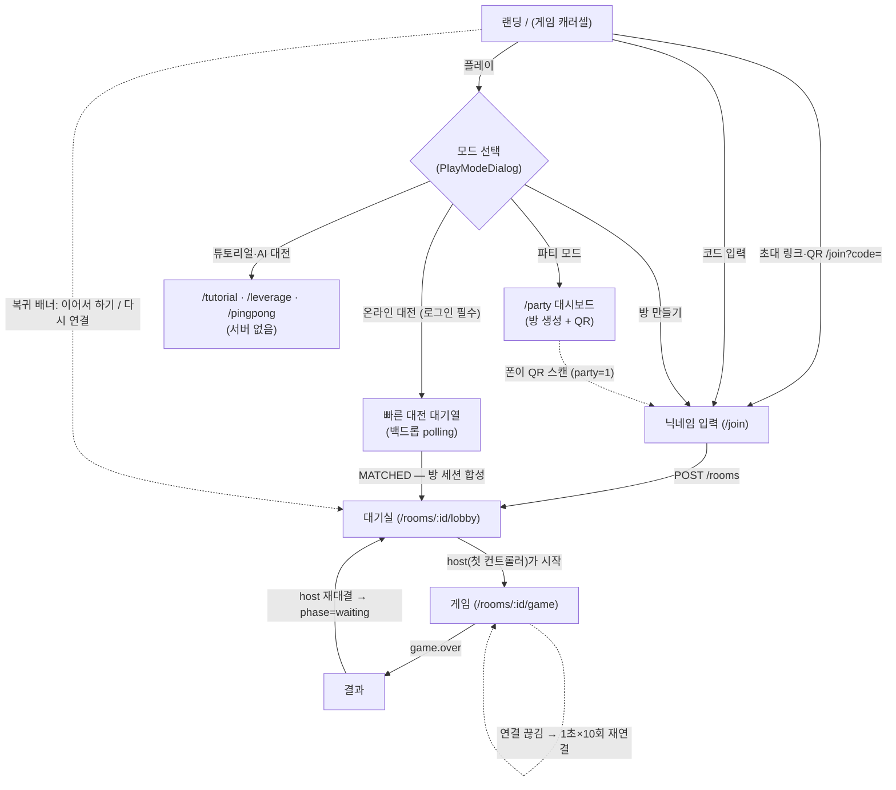

# 제품 기준 — 범위·게임·유저 플로우·라우트

> 기준일: 2026-08-13 — 현재 코드 기준. 문서와 코드가 다르면 코드가 이긴다.

## 제품 범위

- 모바일 웹 실시간 멀티플레이 게임 플랫폼. 갤럭시 Chrome · iPhone Safari 지원, 지원 하한
  뷰포트 320px. 앱 설치 없음, HTTPS/WSS 필수.
- 게스트(닉네임만) 또는 카카오·구글 로그인. 로그인 입장이면 결과가 계정에 귀속된다.
- 진입 경로 4종: **방 만들기**(초대 코드·링크·QR) · **빠른 대전**(대기열 매칭, 로그인
  필수) · **파티 모드**(큰 화면 + 폰 컨트롤러) · **로컬 모드**(튜토리얼·레버리지·AI 탁구).
- 서버가 방·게임 상태의 최종 권위자. 음성 채팅만 WebRTC P2P(풀메시, 시그널링은 같은 WS).
- 센서 실패·권한 거부 시 탭 조작으로 완주 가능. 주간 랭킹·게임 결과 기록.

## 게임 카탈로그 (`src/games.ts`가 SSOT)

| # | key | 이름 | 인원 | 조작 | 상태 |
|---|---|---|---|---|---|
| 01 | `yacht` | 요트 다이스 | 1–6 | 휴대폰 흔들기 · 탭 | live (`YACHT_DICE`) |
| 02 | `pingpong` | 탁구 | 1–2 | 화면 탭 · 폰 스윙 | live (`PING_PONG`) |
| 03 | `duel` | 석양이 진다 | 2 | 화면 탭 · 폰 휘두르기 | live (`DUEL`) |
| 04 | `liars` | 라이어스 다이스 | 2–6 | 화면 탭 | 준비 중 |
| 05 | `fishing` | 낚시 | 2–8 | 휴대폰 흔들기 | 준비 중 |

## 유저 플로우

- 야추는 서버 지정 순서의 **턴제** 12라운드(라운드당 최대 3굴림). 관전자는 활성
  플레이어의 흔들기·던지기를 실시간으로 본다(`dice.shake/throw` 계열).
- 타이머는 서버가 deadline만 내려주고 클라가 계산한다. 마감 처리(대신 굴리기·자동
  기록·턴 넘김)는 전적으로 서버.
- 게임 시작·재대결은 host만. host는 서버 상태(`hostId`)이며 나가면 승계된다.
- iOS 센서 권한은 입장 흐름이 아니라 게임 화면(또는 파티 대기실 사용법)에서 요청한다.

## 실제 라우트

전체 표는 [app-shell.md](./app-shell.md). 요약: `/`(랜딩) · `/join`(닉네임/잘못된 초대) ·
`/party`(대시보드) · `/rooms/$roomId/lobby` · `/rooms/$roomId/game` · `/tutorial` ·
`/leverage` · `/pingpong` · `/auth/callback` · `/__dev/*`.

## 닉네임 정책

표시용 값(중복 허용, 식별은 `playerId`/`sessionToken`), NFC 정규화 1~12자 문자·숫자·공백,
검증 단일 관문 + 욕설 필터. 상세는 [auth.md](./auth.md).

## 프론트엔드 안전장치

- 센서 미지원·거부·무값 → 탭 폴백. 던지기 미인식 → 명시적 버튼.
- 진동 미지원(iOS) → 효과음·화면 연출로 대체. 인앱 웹뷰 → 안내 후 "그냥 진행".
- 중복/역순 WS 메시지 → `msgId`·버전 가드로 정합성 회복. 서버 스냅샷이 항상 교정 기준.
- `NOT_YOUR_TURN` — 턴이 아닌 참가자의 굴림·제출을 서버가 거절.

## 미확정·알려진 한계

- 파티 모드 여부가 서버 스냅샷에 없다 — 초대 코드를 직접 입력해 파티 방에 들어오면 일반
  화면으로 뜬다 ([room-and-session.md](./room-and-session.md)).
- 레버리지 다이스는 로컬 전용 — 서버가 2배 규칙을 모른다.
- 게스트 빠른 대전 — 게스트 세션 발급 엔드포인트 이후의 별도 티켓.
- 단위 테스트가 부하 상태에서 간헐 실패하는 이슈(S15P11A406-172)와 그 대응은
  [testing.md](./testing.md)의 커버리지 절 참고.
