# 유저 플로우

> 기준일: 2026-08-01 — [`../../src/app/router.tsx`](../../src/app/router.tsx)와
> `src/app/router.tsx`와 각 도메인의 `screens/`에 있는 실제 라우트·화면 전환을 기준으로 정리했다.
>
> 과거 기획에 있던 "모드 선택(파티/온라인)", "게임 종류 선택", "빠른 대전", "QR 대시보드"는
> 지금 코드에 존재하지 않는다 — 방 하나 = 초대 코드/QR 참가 + 요트다이스 고정이다.

## 전체 흐름

```mermaid
flowchart LR
  subgraph P1["1. 진입"]
    START(["시작 (/)"]) --> CHOICE{"방 만들기 / 코드 참가"}
    START -.->|"초대 링크 /join?code="| CODEVALID{"코드 형식 유효?"}
    CODEVALID -->|"아니오"| INVALID["잘못된 초대 안내"]
    CODEVALID -->|"예"| NICKNAME
  end

  subgraph P2["2. 닉네임·입장"]
    CHOICE -->|"방 만들기"| NICKNAME["닉네임 입력"]
    CHOICE -->|"코드 입력"| CODEINPUT["코드 입력"] --> NICKNAME
    NICKNAME --> LOGINCHECK{"로그인 상태?"}
    LOGINCHECK -->|"예"| ENTERAUTH["세션 토큰과 함께 입장 (결과가 계정에 귀속)"]
    LOGINCHECK -->|"아니오(게스트)"| ENTERGUEST["게스트로 입장"]
    ENTERAUTH --> LOBBY
    ENTERGUEST --> LOBBY
  end

  subgraph P3["3. 대기실"]
    LOBBY["대기실 (/rooms/:roomId/lobby)"] --> INVITE["QR·링크·코드로 초대"]
    LOBBY --> ROLECHECK{"host?"}
    ROLECHECK -->|"예, 2인 이상"| GAMESTART["게임 시작"]
    ROLECHECK -->|"아니오"| WAIT["시작 대기 (실시간 roster 동기화)"]
    WAIT -.->|"phase=playing 수신"| GAME
  end

  subgraph P4["4. 게임 (/rooms/:roomId/game)"]
    GAMESTART --> GAME["GamePlay"]
    GAME --> SENSORCHECK{"센서 권한(iOS)"}
    SENSORCHECK -->|"거부·미지원"| TAPMODE["탭 모드"]
    SENSORCHECK -->|"허용/Android"| SENSORMODE["센서 모드"]
  end

  subgraph P5["5. 턴제 라운드 (최대 12회, 최대 3굴림)"]
    TAPMODE --> TURNCHECK{"내 턴?"}
    SENSORMODE --> TURNCHECK
    TURNCHECK -->|"예"| ROLL["흔들기/탭으로 굴리기"]
    TURNCHECK -->|"아니오"| SPECTATE["관전: dice.shake/throw로 상대 동작 실시간 시청"]
    SPECTATE --> TURNCHECK
    ROLL --> REROLL{"3회 이내"}
    REROLL -->|"예"| KEEP["킵할 주사위 선택"] --> ROLL
    REROLL -->|"확정"| CATEGORY["족보 카테고리 선택"]
    CATEGORY --> NEXTTURN{"모든 참가자 완료 또는 타임아웃"}
    NEXTTURN -->|"아니오"| TURNCHECK
    NEXTTURN -->|"예, 12라운드 미완"| TURNCHECK
  end

  subgraph RECONNECT["재접속"]
    ROLL -.->|"연결 끊김"| RECONN["재접속 시도"] --> SNAPSHOT["서버 스냅샷으로 상태 복구"] --> TURNCHECK
  end

  subgraph P6["6. 결과"]
    NEXTTURN -->|"12라운드 완료"| RESULT["최종 결과 (GameResult)"]
    RESULT --> REMATCHCHECK{"host?"}
    REMATCHCHECK -->|"예"| REMATCH["재대결 요청 → 대기실로 복귀"]
    REMATCHCHECK -->|"아니오"| WAITHOST["host의 재대결 요청 대기"]
    REMATCH --> LOBBY
    WAITHOST -.-> LOBBY
  end

  classDef p1 fill:#ffcdd2,stroke:#c62828,color:#3e0000;
  classDef p2 fill:#ffe0b2,stroke:#ef6c00,color:#3e2200;
  classDef p3 fill:#b2ebf2,stroke:#00838f,color:#062a2d;
  classDef p4 fill:#bbdefb,stroke:#1565c0,color:#0d1b2a;
  classDef p5 fill:#fff59d,stroke:#f9a825,color:#3e2723;
  classDef p6 fill:#c8e6c9,stroke:#2e7d32,color:#0b2e13;
  classDef reconnect fill:#e1bee7,stroke:#6a1b9a,color:#2a0a3d;

  class START,CHOICE,CODEVALID,INVALID p1
  class NICKNAME,CODEINPUT,LOGINCHECK,ENTERAUTH,ENTERGUEST p2
  class LOBBY,INVITE,ROLECHECK,GAMESTART,WAIT p3
  class GAME,SENSORCHECK,TAPMODE,SENSORMODE p4
  class TURNCHECK,ROLL,SPECTATE,REROLL,KEEP,CATEGORY,NEXTTURN p5
  class RECONN,SNAPSHOT reconnect
  class RESULT,REMATCHCHECK,REMATCH,WAITHOST p6
```

## 페이즈 요약

1. **진입** — 방 만들기 또는 코드 입력. 초대 링크(`/join?code=`)는 코드 입력만 생략한다.
2. **닉네임·입장** — 로그인 상태면 결과가 계정에 귀속되고, 게스트면 귀속되지 않는다.
3. **대기실** — host만 시작 버튼을 누를 수 있다. QR/링크/코드로 초대.
4. **게임 진입** — iOS는 센서 권한을 게임 화면 진입 후에 요청한다(입장 흐름에는 포함하지 않음).
5. **턴제 라운드** — 최대 12라운드, 라운드당 최대 3회 굴림. 내 턴이 아니면 관전자로서 상대의
   흔들기·던지기를 실시간으로 본다.
6. **결과** — host만 재대결(대기실 복귀)을 요청할 수 있다.

세부 화면 매핑은 [`../current-baseline.md`](../current-baseline.md)의 "실제 라우트" 표,
요트다이스 점수 규칙은 [`yacht-rules.md`](./yacht-rules.md)를 참고한다.
